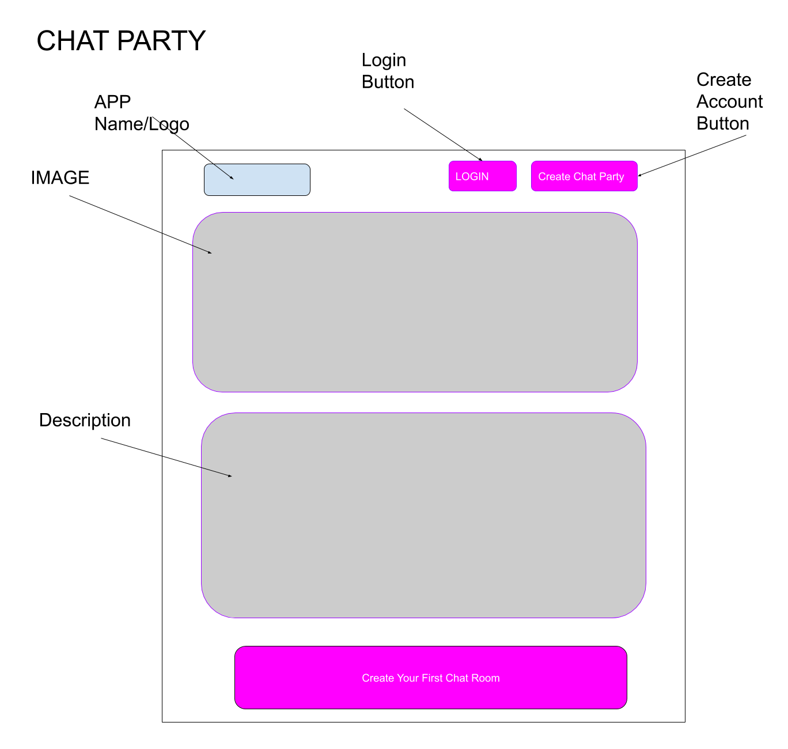
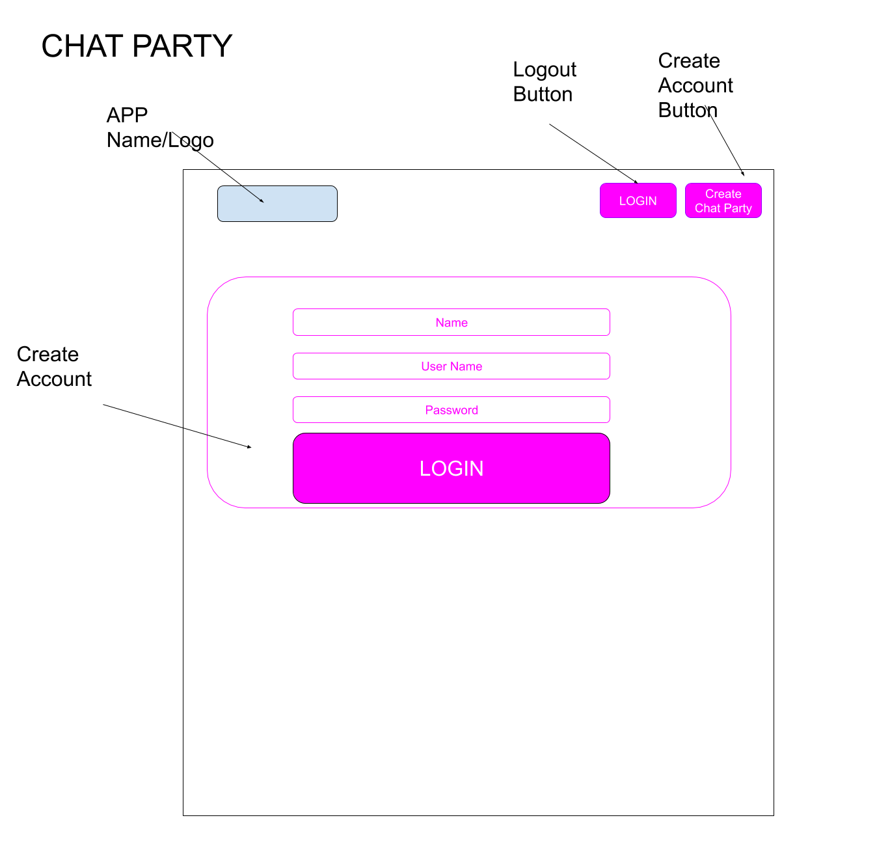
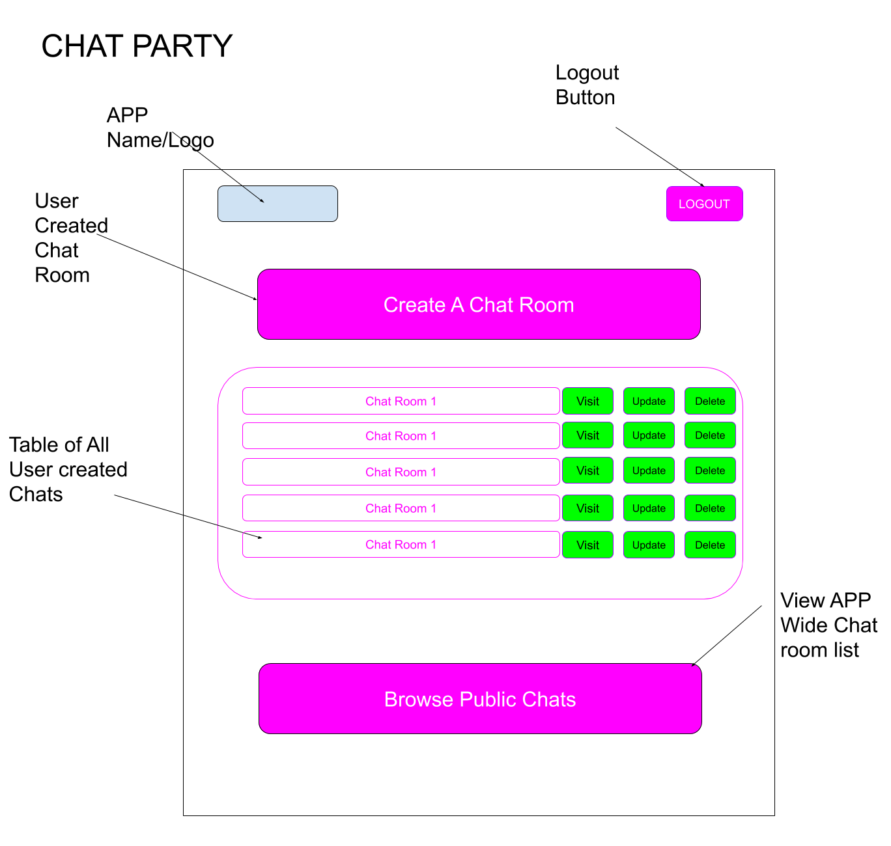
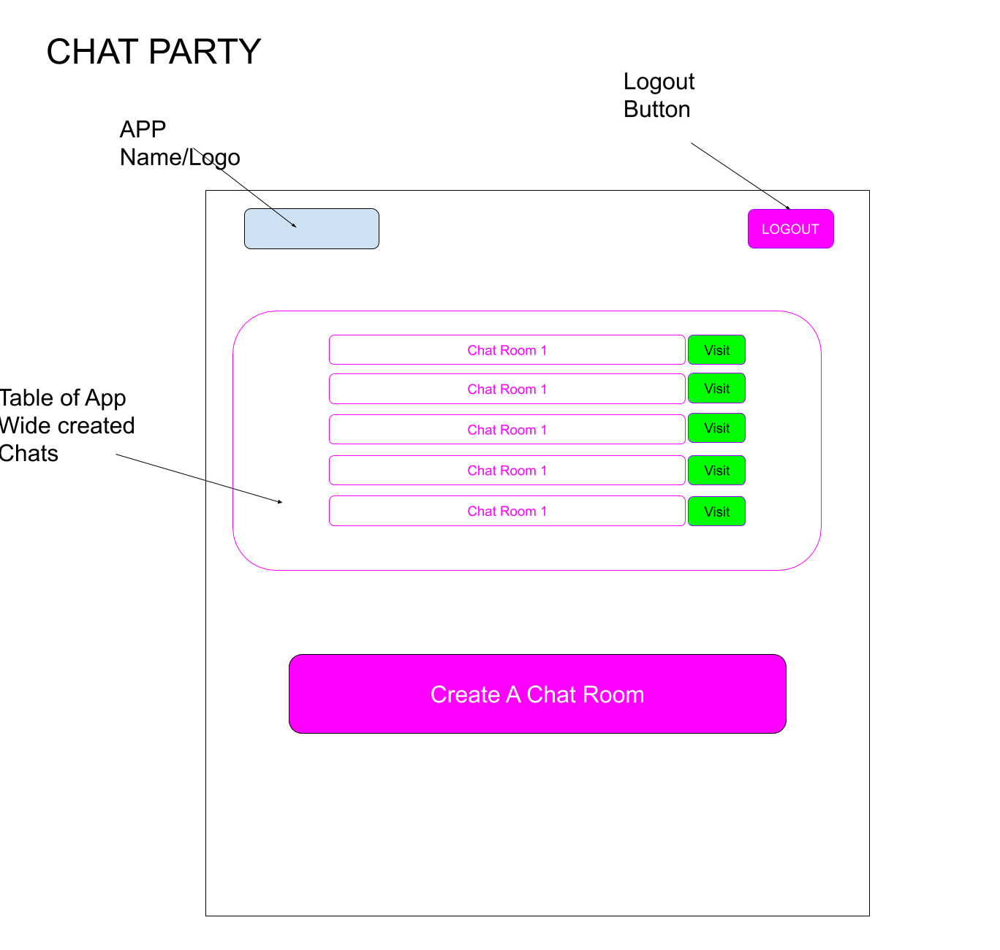
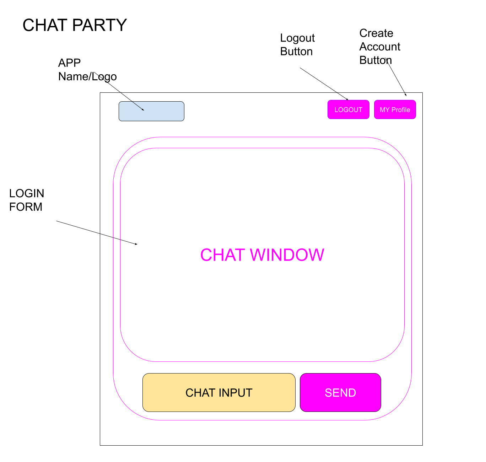

# Chat Party

Chat Party is live chat application that allows users to create their own chat rooms. Create a chat room and invite users to participate.

# Technologies Used:

CRUD(CREATE, READ, UPDATE, DELETE) using REST API, Node.js, Express, Live Chat using SocketIO, MongoDB, Mongoose, User Authentication with Express Session, Local Image Upload using Multer, HTML5, Bootstrap & JQuery.

# Features to Meet Requirements:

Create Chat room
View All Chat rooms
Update Chat room
Delete Chat room
Create User Account
Update User Account
View User Account

# Stretch Goals:
Integrate User Authentication & Authorization
Integrate SocketIO
Integrate Image Uploads
Integrate Avatars and Usernames into live chat window

# Biggest Challenges
Creating Authorization to specific to currentUser
Creating new chat rooms with one .ejs render
Sending avatars and usernames via sockets into chat rooms

# Workflow on Trello:
https://trello.com/invite/b/xeBeVRpr/d5075484bda28ab8f18efc44f4fa5860/sei-chat-party

# Wireframes

////// Main Index /////

////// Create An Account /////

////// Log In /////

////// User Index /////

////// View All Chat Rooms /////

////// Chat Room /////

# Demo
https://chat-party.herokuapp.com
